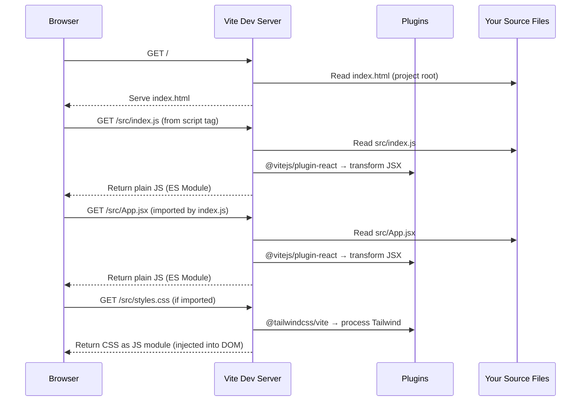
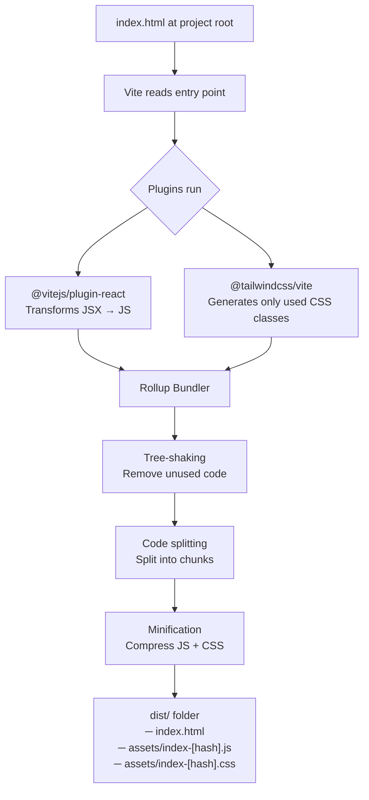
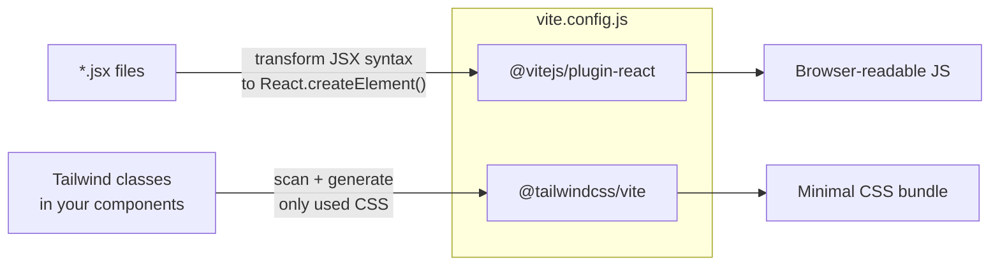
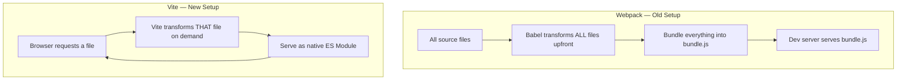

# How Vite Handles the Build Process

## Dev Mode vs Production Build

Vite behaves very differently depending on whether you run `vite` (dev) or `vite build` (production).

---

## Dev Mode (`npm start` → `vite`)

In dev mode, Vite does **not bundle** your code. It starts a dev server and lets the browser request each file individually using native ES Modules. Files are transformed on demand.

> **Key insight**: Vite never bundles files in dev mode. Each `import` becomes a real HTTP request. This is why it starts instantly regardless of project size.

---

## Production Build (`npm run build` → `vite build`)

In production, Vite uses **Rollup** under the hood to bundle everything into optimized static files.

---

## How Plugins Fit In

---

## Comparison: Webpack (before) vs Vite (after)

> **Why Vite is faster in dev**: Webpack builds the entire bundle before serving anything. Vite only transforms what the browser actually asks for, so startup is near-instant.
